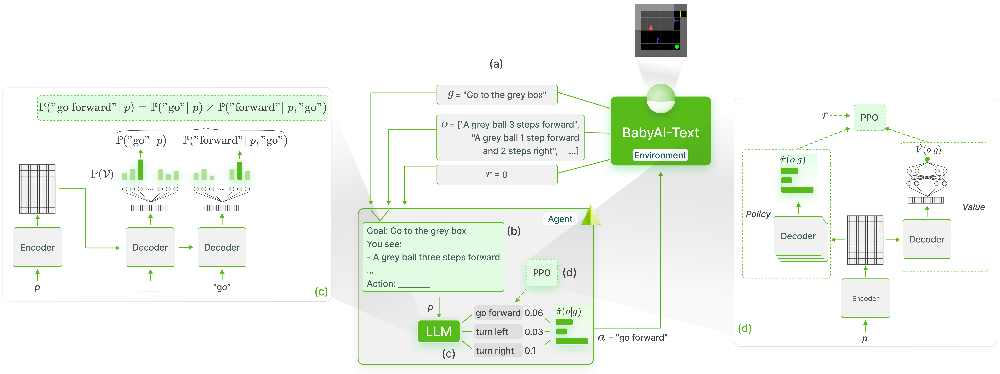
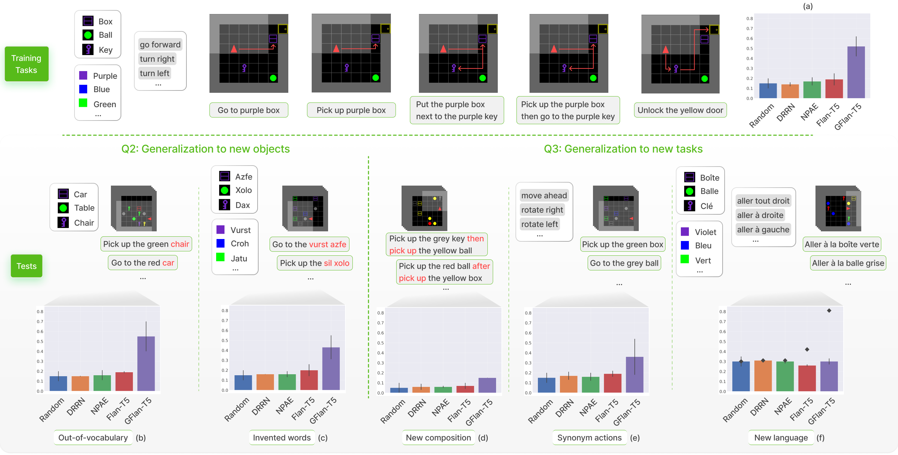

# Grounding Large Language Models with Online Reinforcement Learning

This repository contains the code used for our paper [Grounding Large Language Models with Online Reinforcement Learning](https://arxiv.org/abs/2302.02662).
We perform functional grounding of LLMs' knowledge in BabyAI-Text: 


We then perform an in-depth anaylsis of the generalization abilities of our trained agents:


We release our [BabyAI-Text environment](babyai-text) along with the code to perform our experiments (both training agents and evaluating their performance).
We rely on the [Lamorel](https://github.com/flowersteam/lamorel) library to use LLMs.

Our repository is structured as follows:

📦 Grounding_LLMs_with_online_RL  
┣ 📂 [`babyai-text`](babyai-text) -- *our BabyAI-Text environment*       
┣ 📂 [`experiments`](experiments) -- *code for our experiments*    
┃ ┣ 📂 [`agents`](experiments/agents) -- *implementation of all our agents*  
┃ ┃ ┣ 📂 [`bot`](experiments/agents/bot)  -- *bot agent leveraging BabyAI's bot*  
┃ ┃ ┣ 📂 [`random_agent`](experiments/agents/random_agent)  -- *agent playing uniformly random*  
┃ ┃ ┣ 📂 [`drrn`](experiments/agents/drrn)  -- *DRRN agent from [here](https://github.com/microsoft/tdqn)*  
┃ ┃ ┣ 📂 [`ppo`](experiments/agents/ppo)  -- *agents using PPO*  
┃ ┃ ┃ ┣ 📜 [`symbolic_ppo_agent.py`](experiments/agents/ppo/symbolic_ppo_agent.py)  -- *SymbolicPPO adapted from BabyAI's PPO*  
┃ ┃ ┃ ┗ 📜 [`llm_ppo_agent.py`](experiments/agents/ppo/llm_ppo_agent.py)  -- *our LLM agent grounded using PPO*  
┃ ┣ 📂 [`configs`](experiments/configs)  -- *Lamorel configs for our experiments*  
┃ ┣ 📂 [`slurm`](experiments/slurm) -- *utils scripts to launch our experiments on a SLURM cluster*  
┃ ┣ 📂 [`campaign`](experiments/campaign) -- *SLURM scripts used to launch our experiments*  
┃ ┣ 📜 [`train_language_agent.py`](experiments/train_language_agent.py) -- *train agents using BabyAI-Text (LLMs and DRRN) -> contains our implementation of PPO loss for LLMs as well as additional heads on top of LLMs*  
┃ ┣ 📜 [`train_symbolic_ppo.py`](experiments/train_symbolic_ppo.py) -- *train SymbolicPPO on BabyAI (with BabyAI-Text's tasks)*  
┃ ┣ 📜 [`post-training_tests.py`](experiments/post-training_tests.py) -- *generalization tests of trained agents*  
┃ ┣ 📜 [`test_results.py`](experiments/test_results.py) -- *utils to format results*  
┃ ┗ 📜 [`clm_behavioral-cloning.py`](experiments/clm_behavioral-cloning.py) -- *code to perform Behavioral Cloning on an LLM using trajectories*

## Installation steps
1. **Create conda env**
```
conda create -n dlp python=3.10.8; conda activate dlp
```
2. **Install PyTorch**
```
conda install pytorch==1.12.1 torchvision==0.13.1 torchaudio==0.12.1 cudatoolkit=11.3 -c pytorch
```
3. **Install packages required by our package**
```
pip install -r requirements.txt
```
4. **Install BabyAI-Text**: See installation details in the [`babyai-text`](babyai-text) package
6. **Install Accelerate**
```
cd v0.13.2/accelerate-0.13.2; pip install -e .; cd ../..
```
7. **Install Lamorel**
```
git clone https://github.com/ClementRomac/lamorel.git; cd lamorel/lamorel; pip install -e .; cd ../..
```

## Launch
Please use Lamorel along with our [configs](experiments/configs).
You can find examples of our training scripts in [campaign](experiments/campaign).