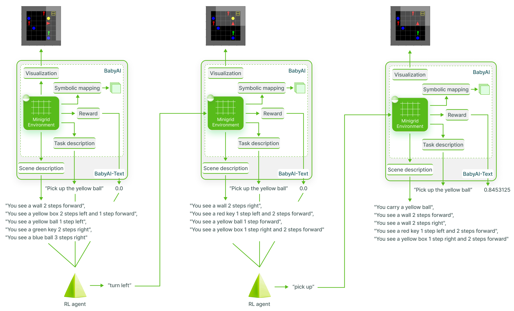

# BabyAI-Text
BabyAI-Text is a wrapper on top of BabyAI to make it a text-only environment returning a textual description of the agent's observation.


## Installation
1. Install BabyAI
```
pip install blosc; cd babyai-text/babyai; pip install -e .; cd ..
```
2. Install gym-minigrid
```
cd gym-minigrid; pip install -e.; cd ..
```
3. Install BabyAI-Text
```
pip install -e .
```

## New environment
We introduce two new environments containing a mix of BabyAI's tasks (*Go to*, *Pick up*, *Put next to*, *Unlock*, *Pick up <then|after> go to*, *Pick up <then|after> pick up*):
- **BabyAI_MixedTrainLocal**: Training tasks in a single room setup (without some objects and the *Pick up <then|after> pick up* task)
- **BabyAI_MixedTestLocal**: Test tasks in a single room setup (including never seen objects and the *Pick up <then|after> pick up* task)

To use them, import our package and create the GYM environment:
```python
import gym
import babyai_text

env = gym.make("BabyAI_MixedTrainLocal")
```